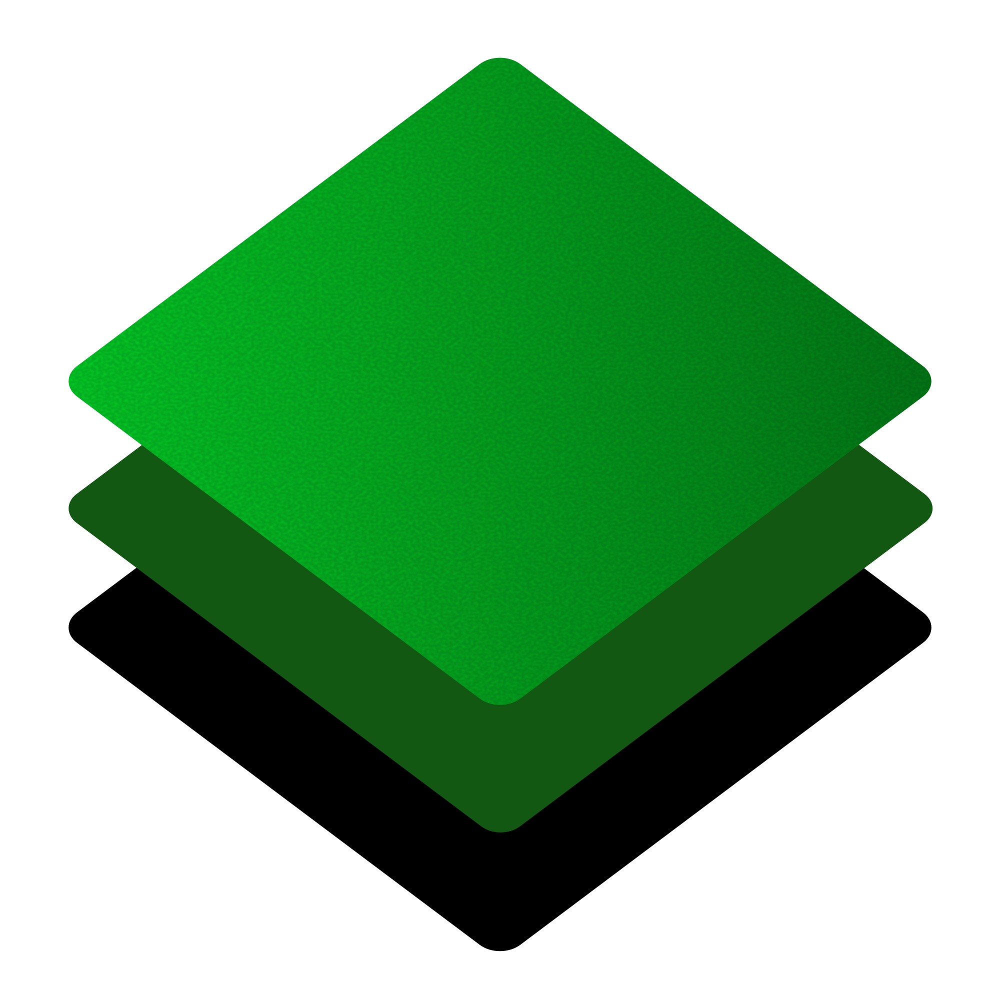
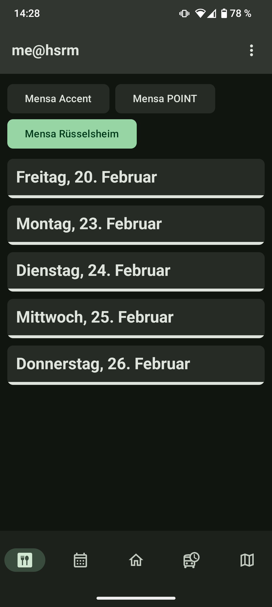
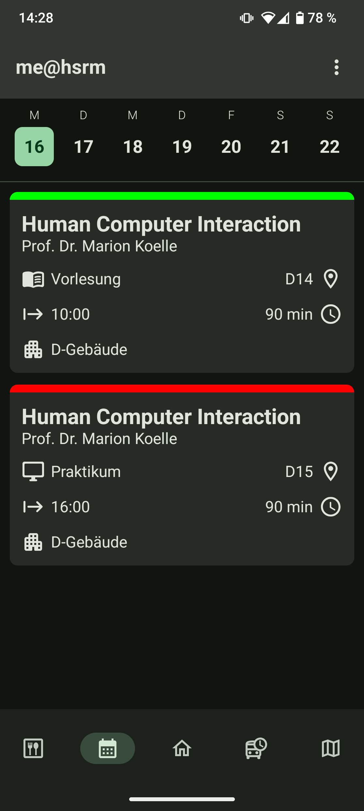
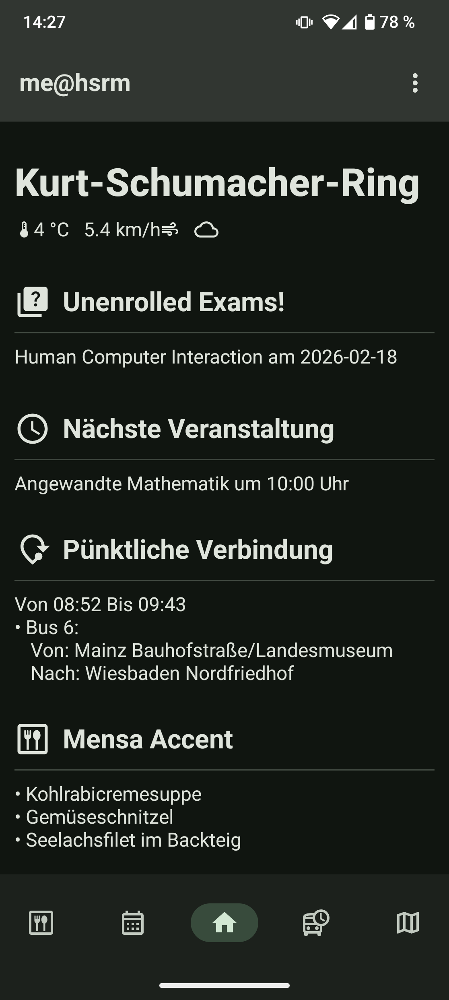
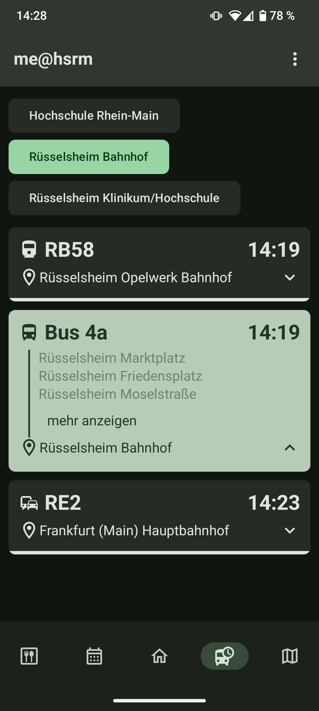
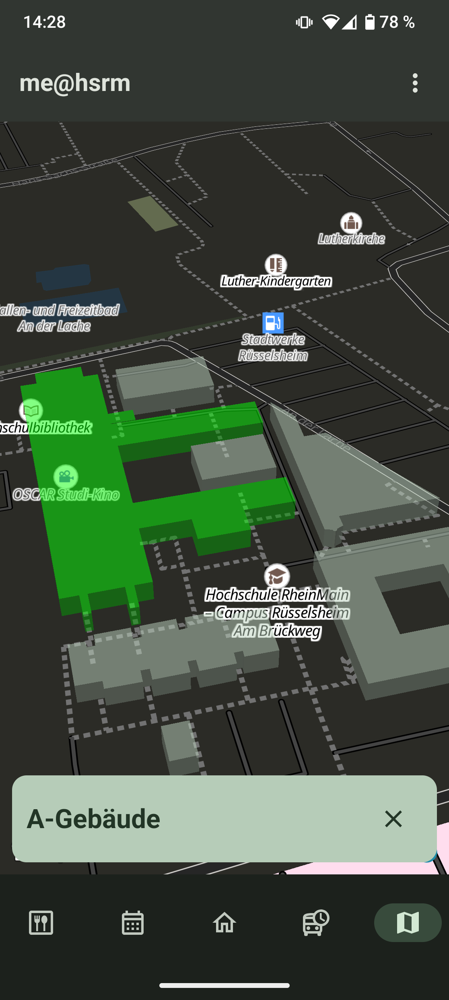

# me@hsrm

<table>
  <tr>
    <td>me@hsrm is a multiplatform app based on compose multiplatform. It targets iOS, Android and desktop and offers many useful features
to students at the campuses of HSRM.</td>
    <td></td>
  </tr>
</table>

## Features

- Mapping:
  Allows for the exploration of a chosen campus and the retrieval of information on the buildings on campus
- Canteen Information:
  me@hsrm parses the canteen data of Studierendenwerk Frankfurt and displays it within the app in a more readable format
- Scheduling and Exams:
  A student's courses and exams are display in a calendar format and the app reminds the user to enroll in exams
- Public Transport: The application implements some of the RMV Open Data Interface and retrieves information about
  departures from campus stops and arrival routes to the campus from a given home stop.
- Weather: Users are quickly informed about weather data on campus in order to prepare.

## Screens

This is what the application looks like in Dark Mode

|                                                            |                                                               |                                                             |                                                                  |                                                |
| ---------------------------------------------------------- | ------------------------------------------------------------- | ----------------------------------------------------------- | ---------------------------------------------------------------- | ---------------------------------------------- |
|  |  |  |  |  |

## Tech Stack

- UI: [Compose UI](https://developer.android.com/jetpack/androidx/releases/compose-ui)
- Navigation: [Voyager](https://voyager.adriel.cafe/)
- Mapping: [MapLibre Compose](https://maplibre.org/maplibre-compose/)
- Map Data: [OpenStreetMap](https://www.openstreetmap.org)
- HTTP Clients: [KTor](https://ktor.io/)
- Dependency Injection: [Koin](https://insert-koin.io/)
- Database: [Room](https://developer.android.com/kotlin/multiplatform/room)
- Animations: [Compottie](https://github.com/alexzhirkevich/compottie)
- Unit Testing: see UI, Compose offers Unit Testing on all platforms

## Further Documentation

The rest of the documentation is only available in German: <a href="documentation/Projektbericht___Portfolio.pdf" download>Download PDF</a>

## Building the Application

This is a Kotlin Multiplatform project targeting Android, Desktop (JVM).

- [/composeApp](./composeApp/src) is for code that will be shared across your Compose Multiplatform applications.
  It contains several subfolders:
  - [commonMain](./composeApp/src/commonMain/kotlin) is for code that’s common for all targets.
  - Other folders are for Kotlin code that will be compiled for only the platform indicated in the folder name.
    For example, if you want to use Apple’s CoreCrypto for the iOS part of your Kotlin app,
    the [iosMain](./composeApp/src/iosMain/kotlin) folder would be the right place for such calls.
    Similarly, if you want to edit the Desktop (JVM) specific part, the [jvmMain](./composeApp/src/jvmMain/kotlin)
    folder is the appropriate location.

### Build and Run Android Application

To build and run the development version of the Android app, use the run configuration from the run widget
in your IDE’s toolbar or build it directly from the terminal:

- on macOS/Linux
  ```shell
  ./gradlew :composeApp:assembleDebug
  ```
- on Windows
  ```shell
  .\gradlew.bat :composeApp:assembleDebug
  ```

### Build and Run Desktop (JVM) Application

To build and run the development version of the desktop app, use the run configuration from the run widget
in your IDE’s toolbar or run it directly from the terminal:

- on macOS/Linux
  ```shell
  ./gradlew :composeApp:run
  ```
- on Windows
  ```shell
  .\gradlew.bat :composeApp:run
  ```

---

Learn more about [Kotlin Multiplatform](https://www.jetbrains.com/help/kotlin-multiplatform-dev/get-started.html)…
